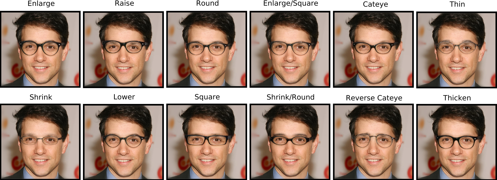

# GlassesGAN: Eyewear Personalization using Synthetic Appearance Discovery and Targeted Subspace Modeling (CVPR 2023)
<sup>[Richard Plesh](https://www.linkedin.com/in/richardplesh/), [Peter Peer](https://www.fri.uni-lj.si/en/about-faculty/employees/peter-peer), [Vitomir Štruc](https://lmi.fe.uni-lj.si/en/vitomir-struc/)<sup>
  
  <a href="https://arxiv.org/abs/2210.14145"></a>
  <a href="https://opensource.org/licenses/MIT"></a>
  [](http://colab.research.google.com/github/pleshro/GlasssesGAN_release/blob/main/Glasses-Try-on-App-demo-V2.ipynb)
  <a href="https://youtu.be/oMiV__LWV4A"></a> 
  
  

  
> We present GlassesGAN, a novel image editing framework for custom design of glasses, that sets a new standard in terms of output-image quality, edit realism, and continuous multi-style edit capability. To facilitate the editing process with GlassesGAN, we propose a Targeted Subspace Modelling (TSM) procedure that, based on a novel mechanism for (synthetic) appearance discovery in the latent space of a pre-trained GAN generator, constructs an eyeglasses-specific (latent) subspace that the editing framework can utilize. Additionally, we also introduce an appearance-constrained subspace initialization (SI) technique that centers the latent representation of the given input image in the well-defined part of the constructed subspace to improve the reliability of the learned edits. We test GlassesGAN on two (diverse) high-resolution datasets (CelebA-HQ and SiblingsDB-HQf) and compare it to three state-of-the-art baselines, i.e., InterfaceGAN, GANSpace, and MaskGAN. The reported results show that GlassesGAN convincingly outperforms all competing techniques, while offering  functionality (e.g.,  fine-grained multi-style editing) not available with any of the competitors.

<p align="center">

</p>

## Description   
Official Implementation of "<a href="https://arxiv.org/abs/2210.14145">GlassesGAN: Eyewear Personalization using Synthetic Appearance Discovery and Targeted Subspace Modeling</a>" paper for both training and evaluation. 
  
**Public release code coming soon!**

## Acknowledgments
This code borrows heavily from [encoder4editing](https://github.com/omertov/encoder4editing) and
[datasetGAN_release](https://github.com/nv-tlabs/datasetGAN_release)

## Citation
If you use this code for your research, please cite our paper <a href="https://arxiv.org/abs/2210.14145">GlassesGAN: Eyewear Personalization using Synthetic Appearance Discovery and Targeted Subspace Modeling</a>:

```
@inproceedings{plesh2023glassesgan,
title={Interpreting the latent space of gans for semantic face editing},
author={Richard Plesh, Peter Peer, Vitomir Štruc},
booktitle={IEEE/CVF Conference on Computer Vision and Pattern Recognition (CVPR)},
year={2023}
}
```
